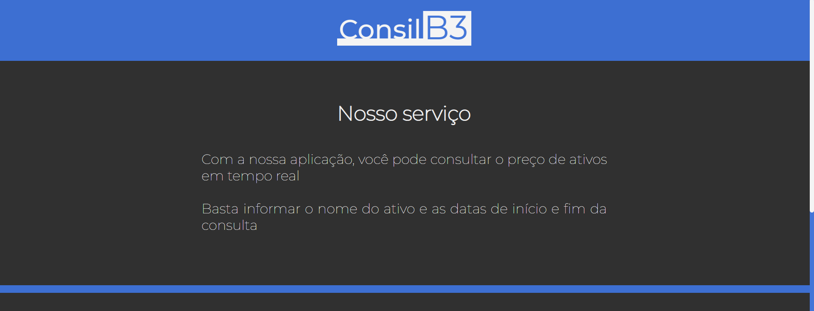
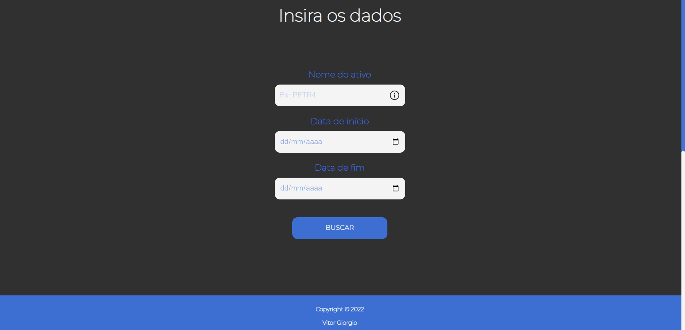
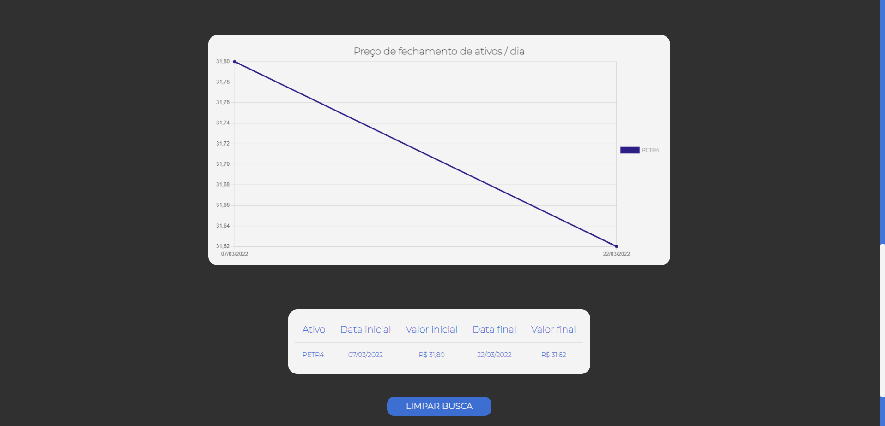
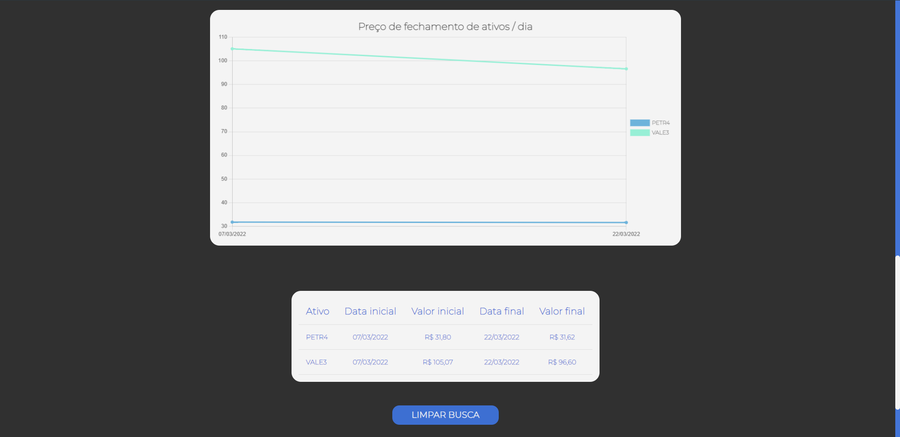
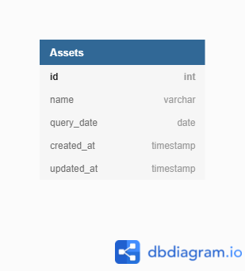
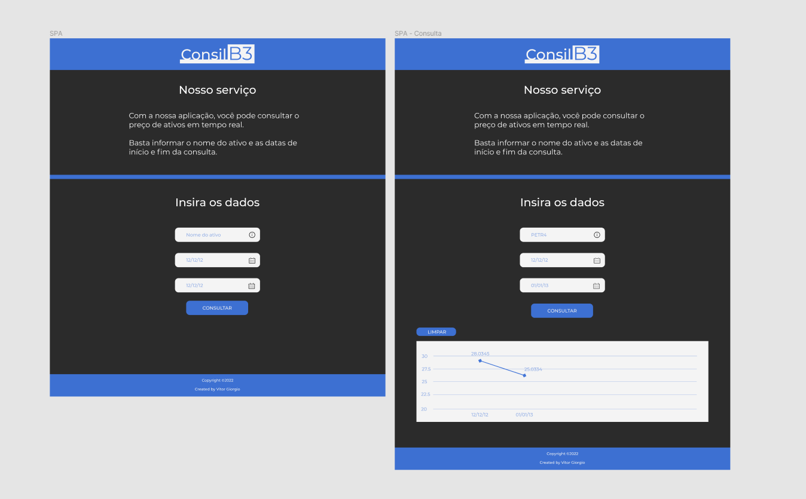

<div align="center">
    <h1> </h1>
    <h2>🎬 ConsilB3 🎬</h2>
    <hr />
    <p>
    <a href="https://nodejs.org/en/"></a>
    <a href="https://pt-br.reactjs.org/"></a>
    <a href="./LICENSE"></a>
    </p>
</div>

## 📜 Descrição

<p>
    <b>ConsilB3</b> é uma SPA (Single-page application) de consulta ao preço de fechamento diário de um ou mais ativos da B3. O resultado da consulta é exibido em um gráfico de linha e em uma tabela de consulta.
</p>
<p>
    O projeto foi desenvolvido como resposta ao desafio técnico proposto pela Inoa.
</p>

<br>

---

<br>

## 🔍 Visualização

<div align="center">



<br>



<br>



<br>



</div>

<br>

---

<br>

## 🛠️ Tecnologias e ferramentas

Foram utilizadas as seguintes tecnologias e ferramentas no projeto:

### Backend:

- [Javascript](https://developer.mozilla.org/pt-BR/docs/Web/JavaScript)
- [Node.js](https://nodejs.org/en/)
- [Express](https://expressjs.com/pt-br/)
- [Sequelize](https://sequelize.org/)
- [MySQL](https://www.mysql.com/)
- [Insomnia](https://insomnia.rest/)

### Frontend:

- [Typescript](https://www.typescriptlang.org/)
- [React](https://pt-br.reactjs.org/)
- [Styled-components](https://styled-components.com/)
- [Material UI](https://mui.com/pt/)
- [react-chartsjs-2](https://react-chartjs-2.js.org/)

### UI & UX:

- [Figma](https://www.figma.com/)

<br>

---

<br>

## 📶 Modelagem ER

<br>

<div align="center">



</div>

<br>

---

<br>

## 🖌️ Prototipação

<br>

- <a href="https://www.figma.com/file/fVEJoDfa68MRV9l1NfJ0JI/TT-Inoa?node-id=1%3A3">Figma</a>

<div align="center">



</div>

<br>

---

<br>

# 🌟 Rodando a aplicação

## Requerimentos

- [Git](https://git-scm.com/) instalado
- [Node](https://node.js.org/) instalado
- [Npm](https://www.npmjs.com/) instalado
- [MySQL](https://dev.mysql.com/downloads/) instalado (para rodar o banco localmente)
- [VSCode](https://code.visualstudio.com/) instalado (mas você pode utilizar outra IDE, se preferir)

<br>

### Siga as etapas para a aplicação funcionar corretamente:

<br>

#### 🔵 No terminal bash (Git), clone este repositório

```
https://github.com/v-giorgio/inoa-b3-challenge.git
```

<br>

#### 🔵 Acesse a pasta do projeto pelo terminal

```
cd inoa-b3-challenge
```

<br>

#### 🔵 Abra o projeto no editor de texto (VSCode)

```
code .
```

<br>

### Backend:

#### 🔵 Abra o terminal e acesse a pasta `backend`

```
cd backend
```

<br>

#### 🔵 Acesse o arquivo `.env.example` e copie o seu conteúdo. Crie um novo arquivo chamado `.env` e cole o conteúdo nele.

```
# API
PORT=

# DATABASE CONNECTION
DB_DIALECT=mysql
DB_USERNAME=
DB_PASSWORD=
DB_HOST=localhost
DB_PORT=
DB_DATABASE=b3_assets

# EXTERNAL API
API_KEY=IZ3QH04OPYT3YO0A
```

#### <b>Nos campos vazios, preencha com os dados para com a conexão ao banco de dados da sua máquina.</b>

#### <b>Atenção</b>:

- O campo PORT altera a porta utilizada para rodar a API. Se não for definida, a API rodará normalmente na porta 3001.
- O campo DB_USERNAME, por padrão, é `root`. Você pode alterá-lo se quiser utilizar uma conexão de banco diferente.
- O campo DB_PASSWORD deve ser preenchido com a senha de acesso à conexão utilizada.
- O campo DB_HOST, por padrão, é `localhost`, mas você também pode alterá-lo se quiser criar a conexão com o banco em outra origem.
- O campo DB_PORT, por padrão, é `3306`, mas você pode alterar a porta utilizada para a conexão.
- O campo DB_DATABASE irá definir o nome do banco criado. Se preferir, pode alterá-lo.
- O campo API_KEY contém a chave de acesso à API externa utilizada, você pode modificá-la, mas deverá requisitar uma nova no no site [AlphaVantage](https://www.alphavantage.co/).

<br>

#### 🔵 Execute o comando para instalar as dependências do projeto no backend

```
npm install
```

<br>

#### 🔵 Execute o comando para criar o banco na conexão configurada

```
npm run database
```

<br>

#### 🔵 Execute o comando para criar a tabela `Assets` no banco

```
npm run migrate
```

<br>

#### 🔵 Rode a API

```
npm start
```

<br>

### Frontend:

#### 🔵 Abra o terminal e acesse a pasta `frontend`

- Retornar à raíz do projeto:

```
cd ../
```

- Acessar o `frontend`:

```
cd frontend
```

<br>

#### 🔵 Execute o comando para instalar as dependências do projeto no frontend

```
npm install
```

<br>

#### 🔵 Rode a aplicação

```
npm start
```

<br>

---

<br>

## 🔃 Rota da API

#### 🪧 `/assets`

Rota para <b>criar</b> um ativo, caso não exista no banco de dados, a partir da consulta à API externa e retorná-lo. Ou apenas retorná-lo caso já exista no banco.<br>
Método: `POST`<br>

Template para enviar os dados:

```
{
	"name": "PETR4",
	"query_date": "2022-03-07"
}
```

<br>
Resposta:

```
{
	"id": 15,
	"name": "PETR4",
	"query_date": "2022-03-07",
	"query_value": 31.8,
	"createdAt": "2022-03-29T19:13:21.000Z",
	"updatedAt": "2022-03-29T19:13:21.000Z"
}
```

<br>

---

<br>

<div align="center">
    <sub>Copyright © 2022</sub>
    <p>MIT licensed</p>
    <h3>✨ Desenvolvido por Vitor Giorgio ✨</h3>
</div>
